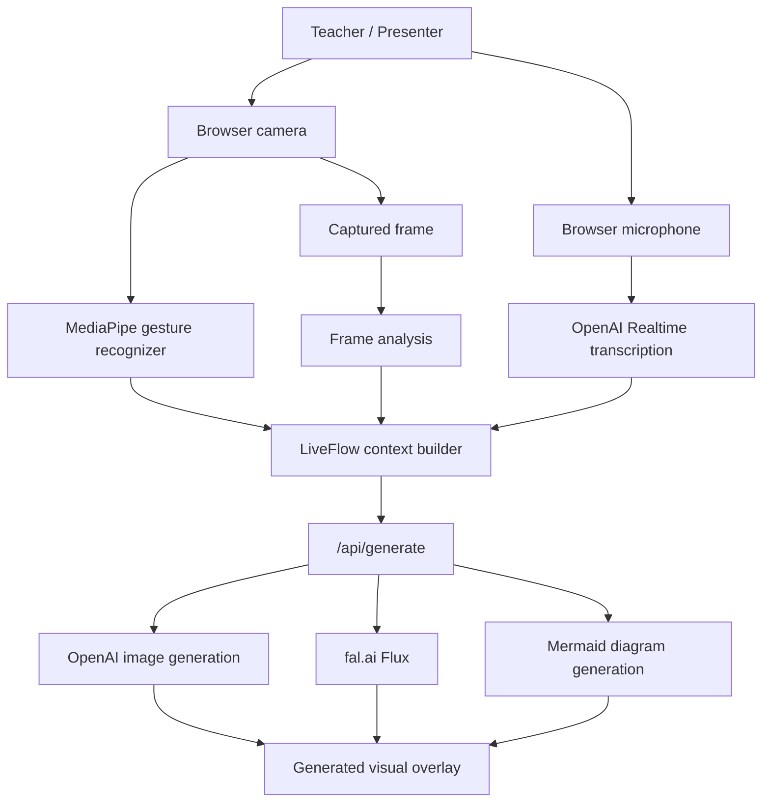
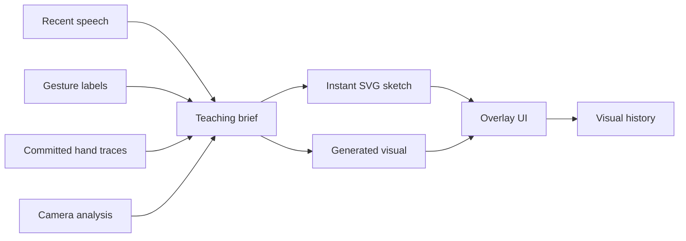

# LiveFlow

LiveFlow is a live lesson copilot that turns speech, camera context, and hand gestures into adaptive visual teaching aids. It is built for educators, learners, and contributors who want a more visual way to follow a live explanation, especially when speech alone is not enough.

The app runs a camera-first classroom overlay in the browser, tracks hand movement with MediaPipe, listens through OpenAI Realtime transcription, analyzes the current frame, and generates visual aids with OpenAI Images, fal.ai, or Mermaid diagrams.

## What It Has

- Live camera stage with hand landmark and gesture tracking.
- Realtime speech transcription in English or Chinese.
- Teacher hand traces that can shape arrows, grouping, emphasis, and diagram flow.
- Automatic visual generation from recent speech, gestures, traces, and camera analysis.
- Manual visual generation when the teacher wants to force an update.
- Provider modes for Flux through fal.ai, GPT Image 2 through OpenAI, and Mermaid diagrams.
- Visual modes for diagrams, metaphors, and step-by-step explanations.
- Overlay controls for locking, hiding, widening, and repositioning generated visuals.
- Visual history, generation queue, prompt inspection, camera diagnostics, and trace memory.

## Visual Overview





## How It Works

The frontend is a Vite React app in `src/`. The main UI lives in `src/App.jsx`, with styling in `src/styles.css`.

When a live session starts, the browser requests camera and microphone access. The camera feed is drawn to a canvas so LiveFlow can render hand landmarks, trace index-finger movement, and capture compressed frame snapshots. MediaPipe runs locally from the files under `public/mediapipe/`.

Speech is streamed through a WebRTC Realtime connection. The server creates a short-lived Realtime client secret at `/api/realtime-token`, so the browser does not need the long-lived OpenAI API key.

The server in `server/index.mjs` handles API calls:

- `GET /api/health` reports server readiness and available provider configuration.
- `GET /api/realtime-token` creates a browser-safe OpenAI Realtime token.
- `POST /api/analyze-frame` sends a camera frame plus transcript and gesture context to OpenAI vision analysis.
- `POST /api/generate` builds the generation prompt and returns either an image URL, a base64 image, a Mermaid diagram, or a fallback SVG.

If keys are missing or a provider fails, the server returns a readable fallback visual instead of crashing the UI.

## Setup

Install dependencies:

```bash
npm install
```

Create `.env.local` in the project root:

```bash
OPENAI_API_KEY=your_openai_api_key
FAL_KEY=your_fal_key
```

`OPENAI_API_KEY` is needed for Realtime transcription, frame analysis, OpenAI image generation, and Mermaid diagram generation. `FAL_KEY` or `FAL_API_KEY` is needed only when using the Flux provider.

Optional environment variables:

```bash
PORT=8787
OPENAI_REALTIME_MODEL=gpt-realtime-2
OPENAI_TRANSCRIBE_MODEL=gpt-4o-transcribe
OPENAI_VISION_MODEL=gpt-4.1-mini
OPENAI_IMAGE_MODEL=gpt-image-2
OPENAI_IMAGE_SIZE=1024x1024
OPENAI_IMAGE_QUALITY=low
OPENAI_MERMAID_MODEL=gpt-4.1-mini
FAL_IMAGE_MODEL=fal-ai/flux/schnell
FAL_NUM_INFERENCE_STEPS=4
FAL_IMAGE_SIZE=square_hd
FAL_GUIDANCE_SCALE=3.5
FAL_ENABLE_SAFETY_CHECKER=true
FAL_OUTPUT_FORMAT=jpeg
FAL_ACCELERATION=high
```

## Running Locally

Start the API server and Vite app together:

```bash
npm run dev
```

The default web app runs on:

```text
https://localhost:5173
```

The API server runs on:

```text
http://localhost:8787
```

For a local HTTP development mode, use:

```bash
npm run dev:local
```

That starts Vite at:

```text
http://127.0.0.1:5174
```

Use Chrome or Safari if the in-app browser does not show camera or microphone permission prompts.

## Using LiveFlow

1. Open the app and choose the speech language.
2. Click **Start live** to start camera tracking and realtime transcription.
3. Speak or type lesson context into the speech panel.
4. Use **Auto** for continuous visual updates, or click **Generate** manually.
5. Choose a provider: **Flux**, **GPT Image 2**, or **Mermaid**.
6. Choose a mode: **diagram**, **metaphor**, or **steps**.
7. Use **Trace** to let finger movement shape the visual layout.
8. Click **Commit** to store a trace in the lesson context.
9. Switch to **2 hands** trigger mode to generate when two open hands are detected.

## Project Structure

```text
.
├── index.html
├── package.json
├── server/
│   └── index.mjs
├── src/
│   ├── App.jsx
│   ├── main.jsx
│   └── styles.css
├── public/
│   └── mediapipe/
│       ├── models/
│       └── wasm/
└── vite.config.js
```

## Scripts

```bash
npm run dev          # Run API and HTTPS Vite dev server
npm run dev:local    # Run API and local HTTP Vite dev server
npm run dev:api      # Run only the Express API server
npm run dev:web      # Run only the Vite app over HTTPS
npm run build        # Build the frontend
npm run preview      # Preview the production build
```

## Notes For Contributors

- Keep API keys on the server side in `.env.local`.
- The browser receives only short-lived Realtime client secrets.
- MediaPipe model and WASM files are served from `public/mediapipe/`.
- Camera and microphone access require a secure browser context, except for trusted localhost origins.
- The app intentionally favors recent speech over camera history when generating visuals, so generated aids stay anchored to the current lesson.

